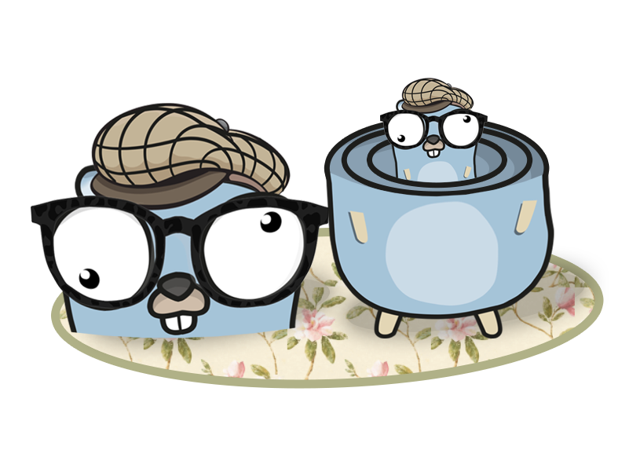

[](https://travis-ci.com/gol4ng/httpware)
[](https://codeclimate.com/github/gol4ng/httpware/maintainability)
[](https://codeclimate.com/github/gol4ng/httpware/test_coverage)
[](https://goreportcard.com/report/github.com/gol4ng/httpware)
[](https://godoc.org/github.com/gol4ng/httpware)

# httpware

Package httpware is a collection of middleware (net/http.Handler wrapper) and tripperware (net/http.RoundTripper wrapper)

- **CorrelationId** gets or creates a `correlation_id` and adds it to the `http.request` Context and in the `http.response` header (in order to propagate this ID throught all microservices)
- **Metrics** will use a given Recorder to collect `inflight request`(current parrallel request count), `request duration` and `response size`.

| Name   | Middleware | Tripperware|
| ------ | :--------: | :--------: |
|**Authentication**|X||
|**AuthenticationForwarder**||X|
|**CorrelationId**|X|X|
|**Metrics**|X|X|
|**Interceptor**|X|X|
|**Skip**|X|X|
|**Enable**|X|X|
|**RateLimiter**|X|X|

## Installation

`go get -u github.com/gol4ng/httpware`

## Quick Start

### Client side

```go
package main

import (
	"net/http"
	"os"
	"runtime"
	
	"github.com/gol4ng/httpware/v3"
	"github.com/gol4ng/httpware/v3/tripperware"
)

func main(){
    // create http client with correlationId activated
    client := &http.Client{
        Transport: tripperware.CorrelationId(),
    }
    
    _, _ = client.Get("fake-address.foo")
    // request will have Header "Correlation-Id: <randomID(10)>"
}
```

### Server side

```go
package main

import (
	"fmt"
	"net/http"
	"os"
	"runtime"
	
	"github.com/gol4ng/httpware/v3"
	"github.com/gol4ng/httpware/v3/correlation_id"
	"github.com/gol4ng/httpware/v3/middleware"
)

func main(){
    port:= ":8001"
    srv := http.NewServeMux()
    srv.HandleFunc("/", func(writer http.ResponseWriter, request *http.Request) {
        // Correlation-Id come directly from the client or was generated by the middleware
        fmt.Println(request.Header.Get(correlation_id.HeaderName))
        writer.WriteHeader(http.StatusOK)
    })
    
    go func() {
        if err := http.ListenAndServe(port, middleware.CorrelationId()(srv)); err != nil {
            panic(err)
        }
    }()
}
```

## Middlewares

A middleware is an `http.Handler` decorator, its role is to wrap arround `http.Handler` or another middleware

A middleware stack is a collection of middleware (`[]Middleware`) that acts has a single Middleware (Append/Prepend).

A stack allows you to DecorateHandler and DecorateHandlerFunc

## Tripperwares

A tripperware is an `http.RoundTripper` decorator, its role is to wrap arround `http.RoundTripper` or another tripperware

A tripperware stack is a collection of tripperware (`[]Tripperware`) that acts has a single Tripperware (RoundTrip/DecorateClient/Append/Prepend).

A stack allows you to DecorateRoundTripper and DecorateRoundTripFunc.

### Decorate existing client
 
You can decorate an existing `http.Client`

```go
client := &http.Client{}
   
// when you decorate client you can set second arg to true if you want a copy
tripperware.CorrelationId().DecorateClient(client, false)
    
_, _ = client.Get("fake-address.foo")
// request will have Header "Correlation-Id: <randomID(10)>"
```

### Act has `http.RoundTripper`

A tripperware can be use has an `http.RoundTripper` 
> `tripperware.CorrelationId() == tripperware.CorrelationId()(http.DefaultTransport)`

```go
client := &http.Client{
    Transport:tripperware.CorrelationId(),
}
    
_, _ = client.Get("fake-address.foo")
// request will have Header "Correlation-Id: <randomID(10)>"
```

### Become a tripperware stack

The `Append` and `Prepend` functions will convert a tripperware into a `[]Tripperware`

```go
roundTripper := tripperware.CorrelationId()
stack := roundTripper.Prepend(func(t http.RoundTripper) http.RoundTripper {
    return httpware.RoundTripFunc(func(req *http.Request) (*http.Response, error) {
        fmt.Println("http request headers :", req.Header)
        return t.RoundTrip(req)
    })
})

client := &http.Client{
    Transport:stack,
}

_, _ = client.Get("fake-address.foo")
// request will have Header "Correlation-Id: <randomID(10)>"
```

## Stack computation

The stack is gonna be computed when you decorate the final round tripper.

m1, m2, m3 are middlewares

`[m1, m2, m3].DecorateHandler(<yourHandler>) == m1( m2( m3( <yourHandler> ) ) )`

t1 t2 t3 are tripperwares

`[t1, t2, t3].DecorateRoundTripper(<yourTripper>) == t1( t2( t3( <yourTripper> ) ) )`

```go
	tripperware := func(before, after string) httpware.Tripperware {
		return func(t http.RoundTripper) http.RoundTripper {
			return httpware.RoundTripFunc(func(req *http.Request) (*http.Response, error) {
				defer fmt.Println(after) // will print string AFTER child round trip executed
				fmt.Println(before) // will print string BEFORE child round trip executed
				return t.RoundTrip(req)
			})
		}
	}

	stack := httpware.TripperwareStack(
		tripperware("A before", "A after"),
		tripperware("B before", "B after"),
		tripperware("C before", "C after"),
		tripperware("D before", "D after"),
	)
	// A( B( C( D( http.DefaultTransport ) ) ) )

	client := &http.Client{
		Transport: stack,
	}
	_, _ = client.Get("http://localhost/")
	//Output:
	//A before
	//B before
	//C before
	//D before
	//D after
	//C after
	//B after
	//A after
```

## Enable/skip middleware or tripperware

Some times you need to have a dynamic middleware|tripperware stack 

For example you need to have a middleware activated on debug mode
If Enable false, the middleware will not be added to the middleware stack 

```go
    debug := true
    stack := httpware.MiddlewareStack(
        middleware.Enable(debug, middleware.CorrelationId()),
    )
```

You can dynamically skip a middleware with your own rule.  
If the callback return true it will skip the execution of targeted middleware

```go
    stack := httpware.MiddlewareStack(
        tripperware.Skip(func(request *http.Request) bool {
            return request.URL.Path == "/home"
        }, middleware.CorrelationId()),
    )
```

## AppendIf PrependIf

For more convinience to build more complex middleware/tripperware stack you can use the AppendIf/PrependIf on Middleware and Middlewares

```go
    debug := true
    stack := httpware.TripperwareStack(
        myTripperware(),
    )
    stack.AppendIf(debug, myOtherTripperware())
    stack.PrependIf(debug, myOtherTripperware2())
```

```go
    debug := true
    myTripper := myTripperware(),
    stack := myTripper.AppendIf(debug, myOtherTripperware())
    stack.PrependIf(debug, myOtherTripperware2())
```
